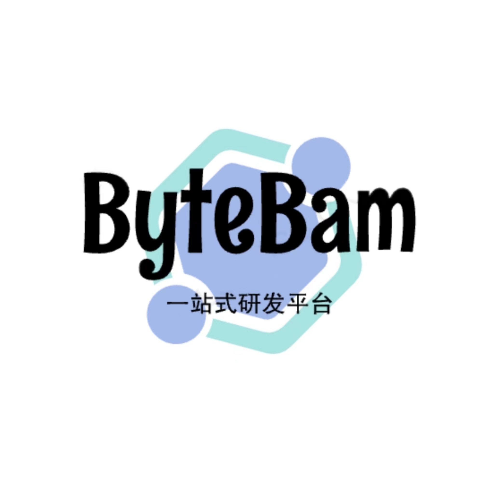

# ByteBam

 

  

  <h3 align="center">🚀ByteBam</h3>

  

    ByteBam 为企业内部量身定制的一站式研发平台
     
     
    <a href="https://github.com/othneildrew/Best-README-Template">浏览文档</a>
    ·
    <a href="https://github.com/ByteBam/ByteBam/issues">反馈 Bug</a>
    ·
    <a href="https://github.com/ByteBam/ByteBam/issues">请求 Feature</a>
  

## 路线图

- [x] 添加更新日志
- [ ] 添加额外的模板和示例
- [ ] 添加「组件」文档，以便更容易复制和粘贴各个部分

到 [open issues](https://github.com/ByteBam/ByteBam/issues) 页查看所有请求的功能 （以及已知的问题）。

## 贡献

贡献让开源社区成为了一个非常适合学习、启发和创新的地方。你所做出的任何贡献都是**受人尊敬**的。

如果你有好的建议，请复刻（fork）本仓库并且创建一个拉取请求（pull request）。你也可以简单地创建一个议题（issue），并且添加标签「feature」。不要忘记给项目点一个 star！再次感谢！

1. 复刻（Fork）本项目
2. 创建你的 Feature 分支 (`git checkout -b feature/AmazingFeature`)
3. 提交你的变更 (`git commit -a -s -m 'feat:Add some AmazingFeature'`)
4. 推送到该分支 (`git push origin feature/AmazingFeature`)
5. 创建一个拉取请求（Pull Request）

(<a href="#top">返回顶部</a>)

<!-- 联系我们 -->
## 联系我们

你的名字 - [@your_GithubName](https://github.com/your_username) - email@zhangzhenting@corp.netease.com
